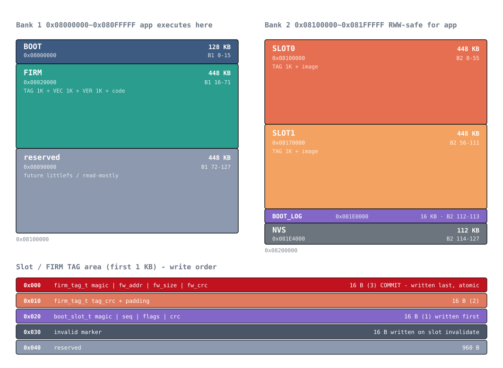

# 00. 메모리 맵

## 목적

부트로더 / 앱 / 업데이트 슬롯 / 로그 / 파라미터 영역의 플래시 배치를 확정한다.
이 배치는 부트로더와 앱이 **반드시 동일하게** 유지해야 하며, 어긋나면 앱이 부팅하지 않는다.

## 대상 파일

- `src/hw/hw_def.h` — `FLASH_ADDR_*` / `FLASH_SIZE_*`
- `src/bsp/ldscript/STM32H563xx_BOOT.ld`
- (앱) `firmware/stm32h5-fw/src/hw/hw_def.h`, `.../STM32H563xx_FLASH.ld`

## 전체 배치



STM32H563ZI : 2MB 플래시 = **뱅크1 1MB + 뱅크2 1MB**, 섹터 8KB × 128/뱅크,
프로그램 단위 16바이트(쿼드워드).

### 뱅크1 (0x08000000 ~ 0x080FFFFF) — 앱이 실행되는 뱅크

| 주소 | 크기 | 섹터 | 용도 |
|---|---|---|---|
| `0x08000000` | 128KB | B1 0–15 | **BOOT** — VECTOR 1K + VER 1K + 코드 126K |
| `0x08020000` | 448KB | B1 16–71 | **FIRM** — TAG 1K + 앱 VECTOR 1K + 앱 VER 1K + 코드 |
| `0x08090000` | 448KB | B1 72–127 | 예약 |

### 뱅크2 (0x08100000 ~ 0x081FFFFF) — 앱 실행 중에도 RWW 로 안전하게 쓰기 가능

| 주소 | 크기 | 섹터 | 용도 |
|---|---|---|---|
| `0x08100000` | 448KB | B2 0–55 | **SLOT0** |
| `0x08170000` | 448KB | B2 56–111 | **SLOT1** |
| `0x081E0000` | 16KB | B2 112–113 | **BOOT_LOG** (8KB × 2 핑퐁) |
| `0x081E4000` | 112KB | B2 114–127 | **NVS** (예약) |

## 설계 결정과 근거

### 왜 업데이트 영역이 뱅크2인가

앱이 실행 중(뱅크1)에 이더넷 OTA 로 새 펌웨어를 받으려면 **자기가 실행 중인 뱅크가
아닌 곳**에 써야 한다. STM32H5 는 뱅크 간 RWW(read-while-write)를 지원하므로
뱅크1 에서 실행하면서 뱅크2 에 쓰는 것이 안전하다. 같은 이유로 파라미터 저장용
NVS 와 부트 로그도 뱅크2 에 둔다.

반대로 뱅크1 을 지우거나 쓰는 동안에는 CPU 가 AHB 스톨로 멈춘다(폴트는 아니다).
이 구간에는 인터럽트도 서비스되지 않으므로 `bootApplySlot()` 직전에 USB 를 끊고,
IWDG 는 쓰지 않는다.

### 왜 슬롯이 2개 대칭인가 (핑퐁)

역할을 고정(UPDATE / BACKUP)하면 업데이트마다 **복사가 2회**(FIRM→BACKUP,
UPDATE→FIRM) 필요하다. 두 슬롯을 번갈아 쓰면 **복사가 1회**로 끝나고 각 슬롯의
소거 횟수도 절반이 된다.

역할 판별에 별도의 활성 슬롯 포인터가 필요 없다. `firm_tag_t` 에 이미 있는
`(fw_size, fw_crc)` 를 FIRM 과 비교하면 된다:

- FIRM 과 **일치**하는 슬롯 = 지금 실행 중인 이미지의 백업본 → 보존 (롤백 대상)
- FIRM 과 **불일치**하는 슬롯 = 낡은 이미지 → 새 이미지 수신 대상

롤백 후에도 이 규칙이 자동으로 유지된다. 자세한 내용은 `08-slot-pingpong.md`.

### 슬롯 크기가 448KB 인 이유

`448KB × 2(슬롯) + 16KB(로그) + 112KB(NVS) = 1024KB` 로 뱅크2 를 정확히 채운다.
현재 앱 바이너리는 `-O0` + 이더넷 스택 포함 141KB 이므로 3.2배 여유가 있다.

## 태그 영역 레이아웃 (슬롯/FIRM 의 첫 1KB)

| 오프셋 | 크기 | 내용 |
|---|---|---|
| `0x000` | 16B | `firm_tag_t` 앞부분 — `magic / fw_addr / fw_size / fw_crc` |
| `0x010` | 16B | `firm_tag_t` 뒷부분 — `tag_crc` + 패딩 |
| `0x020` | 16B | `boot_slot_t` — `magic("SLOT") / seq / flags / crc` |
| `0x030` | 16B | 무효화 마커 |
| `0x040~` | 960B | 예약 |

`firm_tag_t` 의 첫 16바이트가 정확히 `magic + fw_addr + fw_size + fw_crc`,
즉 **검증에 필요한 모든 필드가 한 쿼드워드**에 들어간다. 쿼드워드 프로그램은
원자적이므로 이것을 **마지막에** 쓰면 완벽한 커밋 마커가 된다. 전원 손실 대응의
핵심이며 자세한 내용은 `09b-power-loss.md`.

## 검증

`hw_def.h` 의 상수만으로 경계가 맞는지 계산해 확인했다.

```
BOOT    0x08000000 ~ 0x0801FFFF
FIRM    0x08020000 ~ 0x0808FFFF   (end 0x08090000)
SLOT0   0x08100000 ~ 0x0816FFFF   (end 0x08170000)
SLOT1   0x08170000 ~ 0x081DFFFF   (end 0x081E0000)
BOOTLOG 0x081E0000 ~ 0x081E3FFF
NVS     0x081E4000 ~ 0x081FFFFF   (end 0x08200000)
-> 모두 8KB 섹터 정렬, 경계 일치, 뱅크1 끝(0x08100000)과 정확히 맞물림
```

실기에서도 `flash info` 로 동일한 값이 나오는 것을 확인했다.

## 실측 결과

| 항목 | 값 |
|---|---|
| `FLASHSIZE` 레지스터 (0x08FFF80C) | `0x0800` = 2048KB |
| `FLASH->OPTSR_CUR` (0x40022050) | `0x2D30EDF8` → **SWAP_BANK(bit31) = 0** |
| 디바이스 | Device ID `0x484`, STM32H56x/573, Cortex-M33 |
