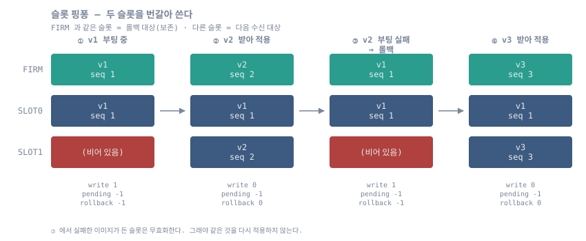
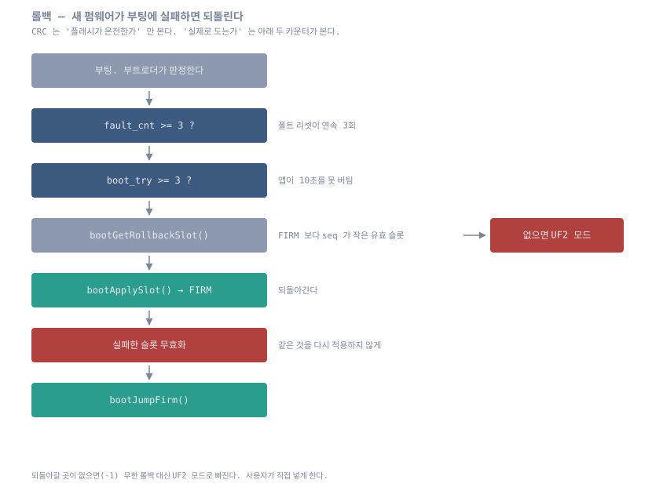

# 08. 슬롯 핑퐁과 롤백

## 목적

새 펌웨어를 받되 **직전 펌웨어를 잃지 않는다.** 갱신에 실패하거나 새 펌웨어가
부팅 후 죽으면 이전 이미지로 되돌아간다.

## 대상 파일

- `src/ap/modules/boot/{boot.c, boot.h}`
- `src/ap/modules/uf2/uf2.c` (수신 슬롯 선택)
- `src/ap/ap.c` (`bootUp()` 판정)



## 왜 핑퐁인가

역할을 고정(UPDATE / BACKUP)하면 업데이트마다 **복사가 2회** 필요하다.

```
UF2 → UPDATE 기록
     → FIRM → BACKUP 복사      ← 매번 추가로 들어간다
     → UPDATE → FIRM 복사
```

두 슬롯을 번갈아 쓰면 **복사가 1회**로 끝나고 각 슬롯의 소거 횟수도 절반이 된다.

```
UF2 → 비활성 슬롯에 기록
     → 그 슬롯 → FIRM 복사
```

반대편 슬롯에 이미 직전 이미지가 들어 있으므로 `FIRM → BACKUP` 복사 자체가 필요 없다.

## 역할 판별 — 별도 포인터가 없다

활성 슬롯을 어딘가에 기록해 두지 않는다. `firm_tag_t` 에 이미 있는
`(fw_size, fw_crc)` 와 `boot_slot_t.seq` 만으로 결정된다.

- FIRM 과 **일치**하는 슬롯 = 지금 실행 중인 이미지의 백업본 → 보존 (롤백 대상)
- FIRM 과 **불일치**하는 슬롯 = 낡은 이미지 → 새 이미지 수신 대상

```c
int8_t bootGetWriteSlot(void)      // 1순위 무효 슬롯, 2순위 FIRM 과 불일치, 3순위 seq 작은 쪽
int8_t bootGetPendingSlot(void)    // FIRM 보다 seq 가 큰 유효 슬롯 = 적용 대기
int8_t bootGetRollbackSlot(void)   // FIRM 보다 seq 가 작은 유효 슬롯 = 되돌아갈 곳
```

동작 예:

```
FIRM=v2(seq2), SLOT0=v2(seq2), SLOT1=v1(seq1)
  write=1  pending=-1  rollback=1
v2 가 부팅 실패 → SLOT1(v1) → FIRM 롤백, SLOT0 무효화
FIRM=v1, SLOT0=무효, SLOT1=v1
  write=0  pending=-1  rollback=-1
v3 수신 → SLOT0 → FIRM 적용
FIRM=v3(seq3), SLOT0=v3(seq3), SLOT1=v1(seq1)
  write=1  pending=-1  rollback=1
```

### seq 가 필요한 이유 — 실기에서 잡은 버그

처음에는 `(fw_size, fw_crc)` 비교만으로 판정했다. 그러자 실기에서 이런 상태가 나왔다.

```
FIRM   V260822R3
SLOT0  V260822R2      <- 낡은 버전
SLOT1  V260822R3

pending slot : 0      <- 잘못됐다
```

SLOT0 은 FIRM 과 다르니 "적용 대기" 로 잡혔지만 실제로는 **낡은 버전**이다.
이 상태에서 `MODE_BIT_UPDATE` 로 리셋하면 **v2 로 다운그레이드**된다.

`boot_slot_t.seq` 를 넣고 `bootGetPendingSlot()` 이 `info.seq > firm.seq` 인 것만
고르도록 고쳤다. 그러려면 FIRM 도 seq 를 가져야 하므로 `bootApplySlot()` 이
`boot_slot_t`(0x020)까지 복사한다.

`firm.seq == 0`(SWD 로 직접 구워 seq 가 없는 상태)이면 **롤백하지 않는다.**
엉뚱한 버전으로 되돌리는 것이 아무것도 안 하는 것보다 나쁘기 때문이다.

## 슬롯 무효화

```c
uint16_t bootInvalidateSlot(uint8_t n)
  (1) boot_slot_t 뒤 무효 마커 쿼드워드(0x030) 기록   ~40us
  (2) 첫 섹터 8KB 소거                                 ~2ms
```

(1)만 성공해도 무효로 판정되므로 소거 도중 전원이 끊겨도 안전하다.



## 롤백 트리거

`bootUp()` 판정 순서는 `09-fault-recovery.md` 참조. 폴트 반복과 부팅 미확인 반복이
같은 경로(롤백 슬롯 적용 + 실패 슬롯 무효화)를 쓰고 로그 이벤트 코드만 다르다.

롤백한 이미지마저 죽으면 카운트가 다시 차는데, 그때는 롤백 슬롯이 없으므로(-1)
UF2 모드로 빠진다. **무한 롤백 루프가 생기지 않는다.**

## 검증

호스트 유닛 테스트가 진리표를 전수로 확인한다.

```bash
cd firmware/stm32h5-boot/test/host && ./run.sh      # test_slot_logic
```

실기는 pytest 가 확인한다.

```bash
cd firmware/stm32h5-boot/test/target && python3 -m pytest test_03_boot.py
```

## 실측 결과

v2 → v3 → v4 를 UF2 로 연속 투입한 결과:

```
[  ] uf2 begin -> slot1 (553 blocks)     <- SLOT0 보존, SLOT1 선택
[  ] uf2 flush slot1 size=141568 crc=0xD403 seq=2
[  ] bootApplySlot(1) 138 KB
Booting..Ver : V260822R3

[  ] uf2 begin -> slot0                  <- 이번엔 반대편
[  ] uf2 flush slot0 crc=0x7C05 seq=3
Booting..Ver : V260822R4
```

적용 후 상태:

```
FIRM   seq=3  V260822R4
SLOT0  seq=3  V260822R4      <- 현재 FIRM 백업본
SLOT1  seq=2  V260822R3      <- 이전 버전

write slot : 1   pending : -1   rollback : 1
```
